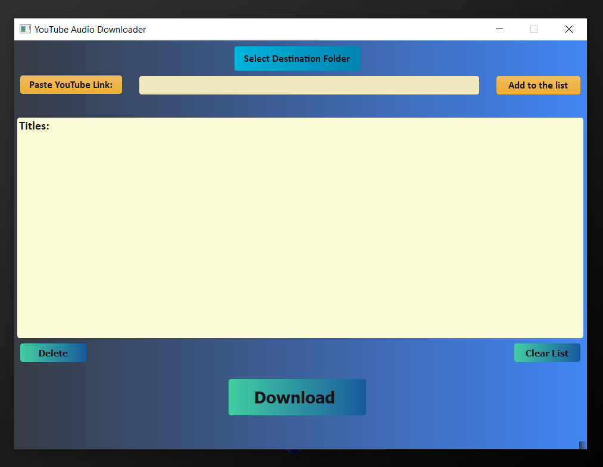
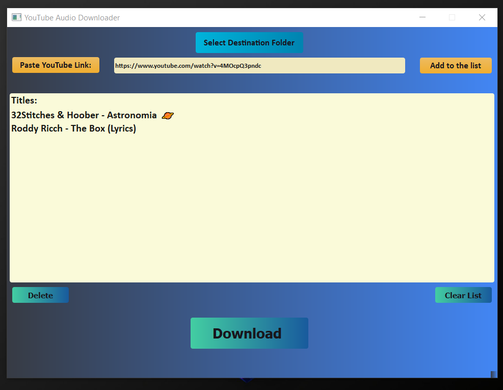

# YouTube Audio Downloader
  
## Description
  YouTube Audio Downloader is an application that downloads a list of YouTube links in the best audio bitrate format available and stores it in the destination folder chosen by the user. It is designed primarily for downloading songs/OSTs from YouTube. 

## Screenshots of the application



## How to create a .exe file?
>**Note:** *Install the modules/frameworks/libraries that these scripts are using if you do not have them already. It is better to copy all of them in your project folder.*

Step 1: Download the python scripts from this repository into your newly created project folder. Run these scripts to check if they are working properly.

Step 2: Create a new module **setup.py** and copy paste the following code:

````markdown
import sys
from cx_Freeze import setup, Executable

setup(name='YouTube Audio Downloader',
      version='1.0',
      description='An application that downloads YouTube video in the best bitrate audio format available',
      executables=[Executable('mainUi_logic.py', base='Win32GUI')])
````

Step 3: Go to your project folder and open **cmd**. Type the following command:
````markdown
python setup.py build
````
After this you will be able to see several folders in your project folder. 

Step 4: Now in your project folder, go to **build->exe.win32-3.6** and you will be able to see **mainUi_logic.exe**.
Now you can click on this .exe file or create a shortcut and give it 
any name you want.

Final step: Enjoy the app! Now you can download songs from YouTube without going to online websites with soo many ads and popups. One click and you get all the songs.

>**Note:** *If you get any errors, then try looking at YouTube videos on how to use **cx_Freeze** module.*
